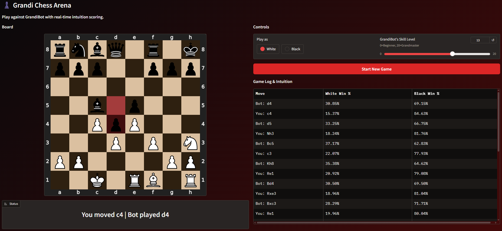

# grandi - the grandmaster's intuition :chess_pawn:

A chess game where a neural network predicts the impact of your moves on the future game outcome - helping you become a better player. *(Best experienced in dark mode)*

> **For Examiners (Scalable ML Course at KTH):**  
> Please refer to [submission.md](submission.md) for a detailed overview of the project architecture, cloud infrastructure, and implementation details.

### Tech Stack
* ♚ **Neural Network**: A PyTorch model trained to evaluate board positions and predict win probabilities.
* ♞ **Continuous Learning**: GitHub Actions workflow that runs tests and fine-tunes weekly.
* ♜ **Cloud Ecosystem**: Scalable backend API on Cloud Run (backed by GCS). BigQuery handles fine-tuning data and observability, connected to Looker Studio.
* ♛ **Full Game**: Playable demo deployed on Hugging Face that saves gameplay logs for fine-tuning.

### How to set it up

**1. Secrets & Environment**
- Create a `.env` file in the root based on `.env.example`.

**2. Google Cloud Platform (GCP)**
- Create a **Cloud Storage Bucket** for model weights.
- Create a **Service Account (SA)** for GitHub Actions.
  - Role: `Editor` (simplest for this project scope)
- Generate a JSON key for the SA.
  - Add this key to GitHub Actions Secrets and your local `.env`.

**3. Deployment (Cloud Run)**
- The model is containerised and deployed to Cloud Run.
- Deployment triggers automatically on successful fine-tuning or can be run manually via `scripts/deploy.sh`.
- Ensure the SA has permissions to deploy.
- Tests are run automatically after deployment.

**4. BigQuery Setup**
- Create a dataset `chess_data` and necessary tables.
- Set up a daily cron job (Scheduled Query) using `ml/monitoring_query.sql` to calculate model performance (opening/midgame/endgame accuracy).

**5. Hugging Face (Frontend)**
- The web UI is in the `web/` submodule.
- HF also need a SA for authentication.
- Add Secrets to the HF Space (not public vars):
  - `GCP_SA_KEY` (JSON content)
  - `SERVICE_URL`
  - `BQ_TABLE_ID`
  - `AUTH_CREDS` (for player password authentication)

**6. Monitoring**
- Connect **Looker Studio** to the BigQuery monitoring table to visualize performance metrics over time.

**7. Training**
- Manually run `preprocess.py` to preprocess the full game dataset.
- Manually run `pretrain.py` to train the model and save the weights to GCS.
- Deploy manually with `scripts/deploy.sh`, fine tuning is then handled automatically.

### Local Development
- Install `uv` (https://docs.astral.sh/uv/)
- After cloning the repo, run ``git submodule update --init --recursive`` to get the submodule.
- Then run `make install` to set up dependencies and hooks. 
- To run tests, use `make test`.