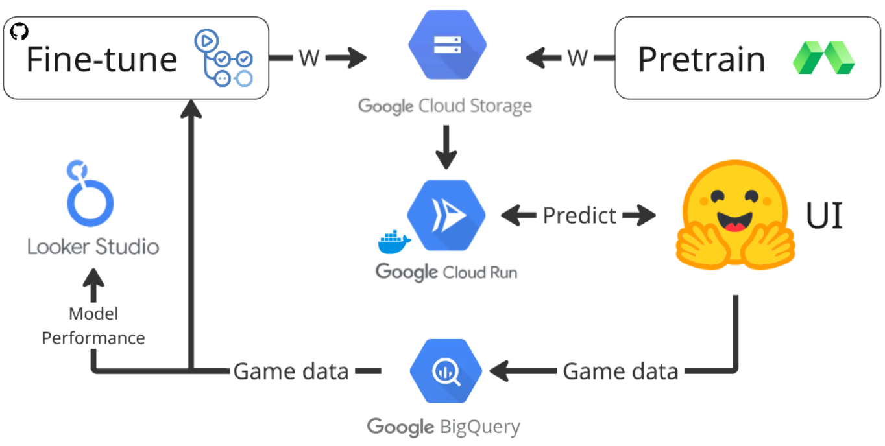

# Project Submission: Scalable Machine Learning (KTH)

**Note for Examiners:** This document is intended for the instructors of the *Scalable Machine Learning* course. To access the live application, please use the credentials provided in the Canvas assignment submission. We have implemented password protection to manage costs since the Hugging Face app is public and it uses our Cloud Run inference service. The app is available at [here](https://huggingface.co/spaces/wannaio/grandi).

## 1. Project Overview
For our Scalable Machine Learning project, we built **Grandi**, a chess engine that tries to mimic "Grandmaster Intuition". instead of searching millions of paths like traditional engines (Stockfish), our model looks at a single board state and instantly predicts the probability of winning.

But it is difficult to get data from amateur games, so it is crucial for our system to adapt to our users (friends that wanted to play). Every game played by users is saved, and used to retrain the model automatically every week.

### Pretraining
Before deploying, we pretrained the model on millions of positions from the [Lichess Database](https://database.lichess.org/) using **Modal** for scalable GPU compute. The `ml/preprocess.py` and `ml/pretrain.py` scripts handle the data filtering and training loop.

## 2. Cloud Architecture
We designed a decoupled, event-driven architecture to handle the different components of the system.

### Frontend (Hugging Face Spaces)
The user interface is a Gradio app hosted on [Hugging Face Spaces](https://huggingface.co/spaces). We chose this for simplicity of hositng the app.
- **Responsibility**: Renders the chess board, handles user moves, and manages authentication.
- **State Management**: While the backend is stateless, the frontend manages the current game session.
- **Data Integration**: When a game ends, the frontend sends the full game history (moves + predictions) directly to **BigQuery** for storage.

### Backend (Google Cloud Run)
We deployed our inference API on **Cloud Run** using FastAPI.
- **Stateless Design**: The service is completely stateless. It accepts a board state $(18 \times 8 \times 8)$ and returns a win probability, and can be used by multiple users at the same time.
- **Dynamic Model Loading**: We implemented a `lifespan` handler in FastAPI. On startup, the service automatically connects to our **Google Cloud Storage (GCS)** bucket, finds the latest model weight file, and loads it into memory. This allows us to update the model without changing the application code.
- **Security**: The service is protected by IAM authentication. Only our frontend (via a Service Account) and our GitHub Actions pipelines can invoke it.

### Data Warehouse (BigQuery)
BigQuery is used for game data and model performance monitoring.
- `chess_data.games`: Stores raw game logs, including the portable game notation (PGN), winner, and the model's "intuition history" (what it thought at every move).
- `chess_monitoring.model_performance`: A derived table populated by our scheduled queries (see below).

## 3. Key Implementations

### Continuous Training Pipeline (GitHub Actions)
We automated the "MLOps loop" using GitHub Actions, scheduled to run every week. The workflow (`fine-tune.yaml`) performs the following steps:
1.  **Extract**: Queries BigQuery for games played in the last week.
2.  **Fine-tune**: Retrains the PyTorch model for a few epochs on this new data.
3.  **Upload**: Pushes the new weights to a `weights/` folder in GCS.
4.  **Redeploy**: Triggers a new revision of the Cloud Run service. Since the service loads the latest weights on startup, this instantly serves the new model to users.

### Monitoring & Observability
We didn't want to just assume the model was working just because the pre-training got ok results. We implemented a monitoring strategy:
- **Scheduled Queries**: We wrote a BigQuery SQL script (`ml/monitoring_query.sql`) that runs as a daily cron job. It parses the JSON logs of yesterday's games.
- **Granular Metrics**: The query calculates the Mean Squared Error (MSE) of the predictions against the actual game result. Crucially, it breaks this down by game phase:
    - **Opening** (First 25% of moves)
    - **Midgame** (25% - 75%)
    - **Endgame** (Last 25%)
    This was done since the model performs relatively poorly on the beginning of the game, which is logical since the game can go in so many directions. But it is interesting to see how the performance evolves as the game progresses.
- **Visualization**: We connected a **Looker Studio** dashboard to the `model_performance` table to visualize these error rates over time.

### Feature Engineering
We based our input representation on **AlphaZero**. Instead of raw piece locations, we convert the board into **18 binary feature planes**:
- **Pieces**: 6 planes for white pieces, 6 for black.
- **Repr**: 2 planes for identifying whose turn it is.
- **Castling**: 4 planes for castling pass-through rights (queenside/kingside for both players).
This allows the Convolutional Neural Network (CNN) to "see" the strategic elements of the board more effectively than a simple flat list of positions.

## 4. Challenges & Learnings
- **IAM & Permissions**: One of the biggest hurdles was configuring the correct permissions (IAM) for the automated pipelines. Debugging why GitHub Actions couldn't push to GCS or why the Cloud Run service couldn't read from the GCS bucket took some time. We learned that "principals of least privilege" are difficult to implement perfectly from the start, often requiring iterative testing with Service Accounts.
- **Catastrophic Forgetting**: When fine-tuning on small user datasets, we found the model forgot its pretraining. We solved this by **freezing the base layers** (ResNet blocks) and using a lower learning rate ($10^{-6}$) during the weekly updates.
- **Distributional Shift**: There is a large gap between the Lichess competition data (Pros) and our amateur users. We mitigated this by removing very high ELO games from the pretraining set and filtering out opening moves (first 20 plies) to focus on raw intuition rather than memorized theory that have very noisy outcomes.

## 5. Future Improvements
- **Feature Store**: We currently calculate features on-the-fly. Implementing a Feature Store would allow us to better manage feature versioning and consistency between training and inference. We did not implement this since our fine tuning data and processing is very small and simple.
- **Contextual Awareness**: Currently, the model predicts based on a single board state. This is a limitation, as the "flow" of a game matters. We did not prioritize this since the project focused on scalable machine learning rather than modelling.
- **Model Performance**: The model currently achieves **~70% accuracy** on test datasets for mid-game and late-game positions. While ok, a single game state can differ heavily from the final result, meaning the model might be "wrong" for some time until the board simplifies. Again, the ML performance was not the main priority so this is also something that could be improved.
